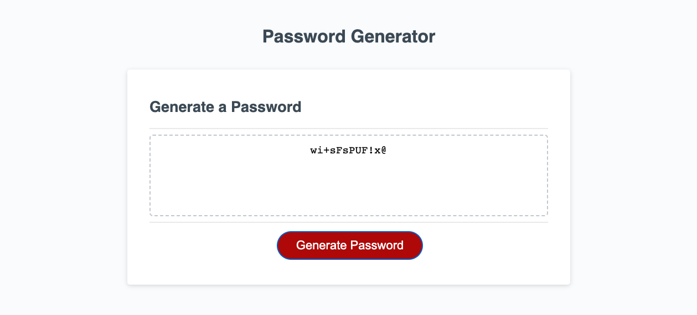

# Password Generator

## Description

This is a Password Generator I developed using JavaScript as the main programming language used.
When the user selects the red Generate Password button a prompt with the first question "How long would
you like you password to be? Has to be at least 8 characters and no more than 128 characters in length."
If the user does not enter the appropriate amount an alert will display "Please enter a valid number between 8 and 128."
and will return to the original question for the user to try again.

Once the user has entered a number between 8 and 128 the next series of questions prompts display;
"Include lowercase letters?", "Include uppercase letters?", "Include numbers?", and "Include special characters?".
If the user does not select at least one of the prompts an alert will display; "Please select at least one character type." then
it will send the user to the first question to try again.

After the user has entered the appropriate amount of characters and has at least selected one of the prompts the application
will generate a password to match the users needs.
## The Application

## URL
https://zmcoder2.github.io/Password-Generator/
